# 图表生成技能

## 重要：工具调用规则

**必须直接使用 Bash 工具执行 shell 命令，绝对不要使用 Task 工具来执行命令。**
- 所有 shell 命令通过 Bash 工具直接执行
- 不要将 Bash 作为 Task 的 subagent_type
- 不要使用 Task 工具来委托执行 shell 命令

## 触发条件

当用户输入包含以下关键词时触发：
- "生成图表"、"画图"、"生成时序图"、"生成流程图"
- "diagram"、"mermaid"、"sequence diagram"、"flowchart"
- "画个流程图"、"帮我画"、"生成架构图"
- "类图"、"状态图"、"ER图"、"甘特图"

## 支持的图表类型

### 1. 时序图 (Sequence Diagram)
用于展示对象之间的交互顺序。

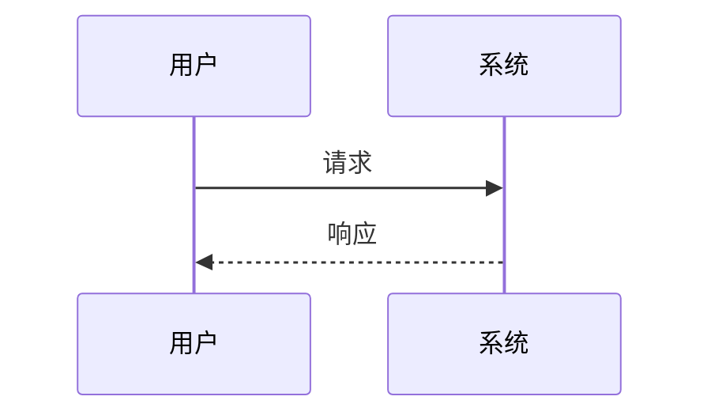

### 2. 流程图 (Flowchart)
用于展示流程和决策。

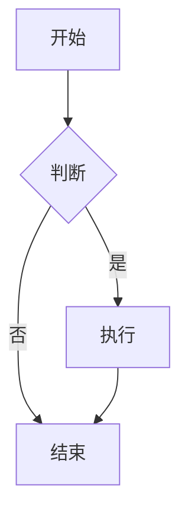

### 3. 类图 (Class Diagram)
用于展示类的结构和关系。

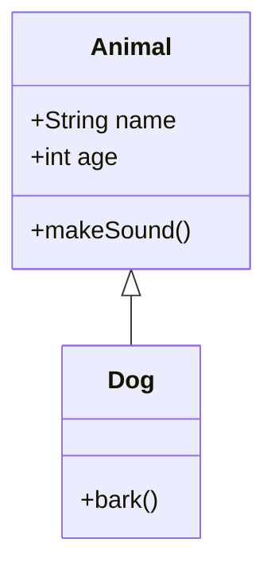

### 4. 状态图 (State Diagram)
用于展示状态转换。

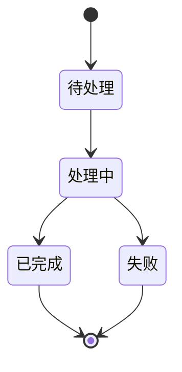

### 5. ER图 (Entity Relationship Diagram)
用于展示数据库实体关系。

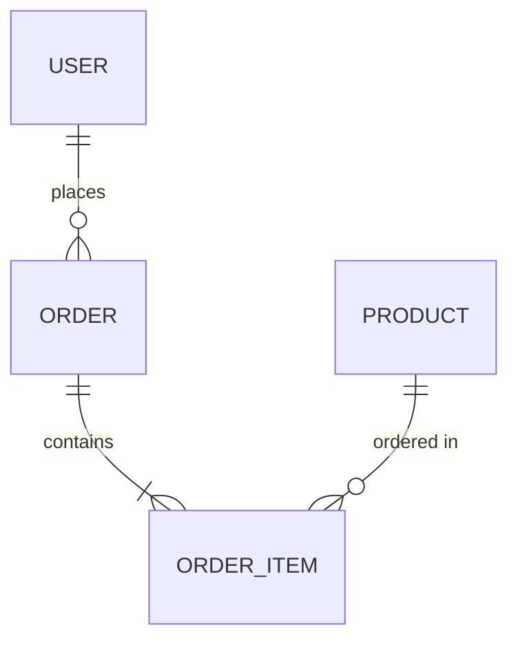

### 6. 甘特图 (Gantt Chart)
用于展示项目进度。

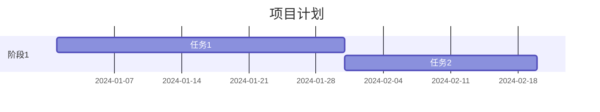

### 7. Git 分支图 (Git Graph)
用于展示 Git 分支历史。

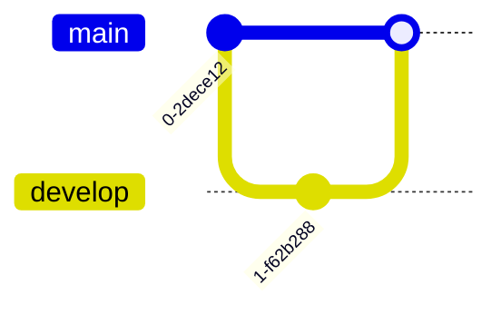

## 执行步骤

### 1. 理解用户需求
- 询问用户想要生成什么类型的图表
- 了解图表的具体内容和场景
- 确认是否需要保存为文件

### 2. 生成 Mermaid 代码
根据用户描述，生成对应的 Mermaid 语法代码。

**时序图关键语法：**
- `participant A as 名称` - 定义参与者
- `A->>B: 消息` - 同步消息
- `A-->>B: 消息` - 异步响应
- `alt/else/end` - 条件分支
- `loop/end` - 循环
- `par/and/end` - 并行

**流程图关键语法：**
- `A[矩形]` - 普通节点
- `B{菱形}` - 判断节点
- `C([圆角])` - 圆角节点
- `D[(数据库)]` - 数据库节点
- `A --> B` - 箭头连接
- `A -->|文字| B` - 带文字的箭头

**类图关键语法：**
- `+` public, `-` private, `#` protected
- `<|--` 继承, `*--` 组合, `o--` 聚合
- `..>` 依赖, `..|>` 实现

### 3. 输出格式

直接输出 Mermaid 代码块：

````markdown
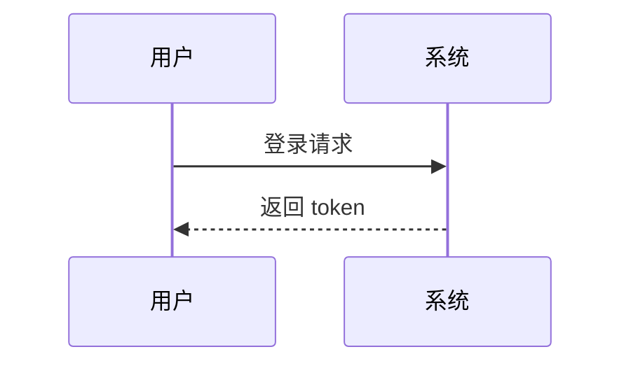
````

### 4. 保存文件（可选）

如果用户需要保存，询问文件名并保存为 `.md` 文件：

```bash
# 保存到当前目录
echo '```mermaid\n...\n```' > diagram.md
```

### 5. 提供使用建议

告知用户如何查看和使用生成的图表：
- VS Code + Mermaid 插件
- draw.io 导入（Arrange → Insert → Advanced → Mermaid）
- 在线工具：https://mermaid.live
- GitHub/GitLab Markdown 原生支持

## 智能生成规则

### 时序图生成规则
1. 识别参与者（用户、系统、服务、数据库等）
2. 按时间顺序排列交互
3. 区分同步调用（->>）和异步响应（-->>）
4. 添加条件分支（alt/else）和循环（loop）

### 流程图生成规则
1. 识别起点和终点
2. 识别判断节点（if/else）
3. 识别循环节点（for/while）
4. 使用合适的节点形状

### 类图生成规则
1. 识别类和接口
2. 识别属性和方法
3. 识别类之间的关系（继承、组合、依赖等）
4. 使用访问修饰符（+/-/#）

## 示例场景

### 场景1：用户登录流程时序图

用户输入：
```
生成一个用户登录的时序图，包括前端、后端API、数据库
```

生成：
````markdown
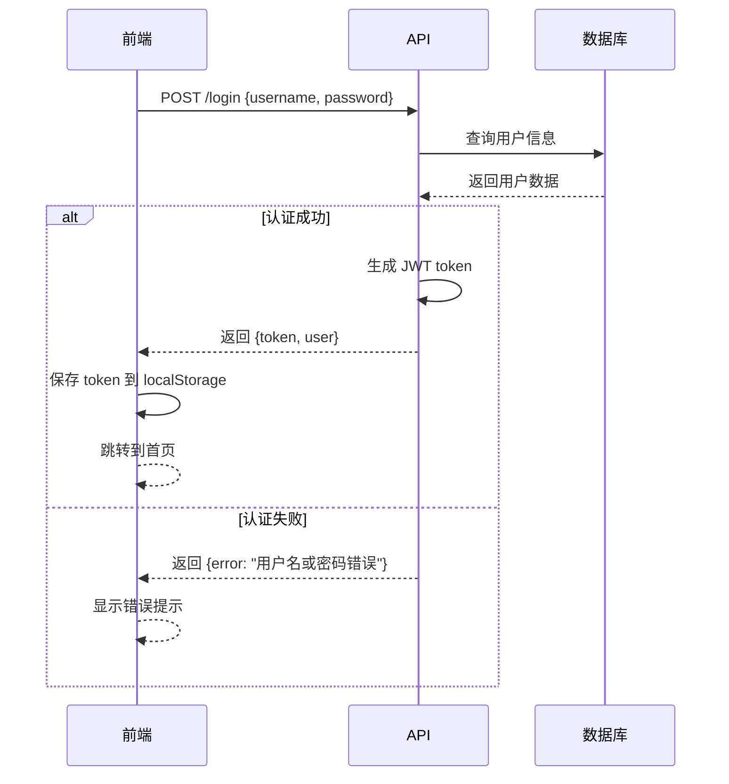
````

### 场景2：订单处理流程图

用户输入：
```
画一个订单处理的流程图
```

生成：
````markdown
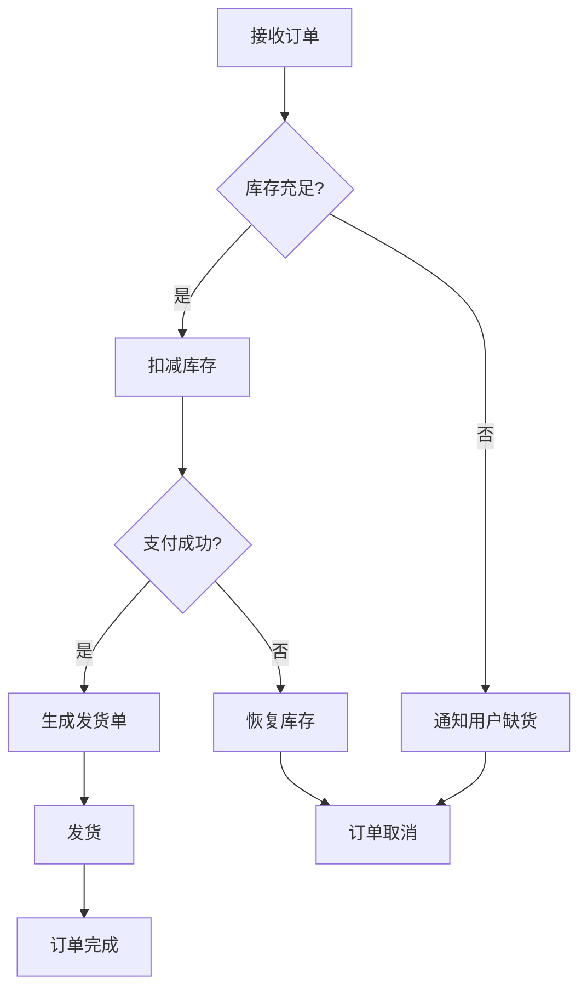
````

## 注意事项

- 使用中文标签时，确保编码为 UTF-8
- 复杂图表建议分步骤生成，避免过于复杂
- 时序图参与者数量建议不超过 6 个
- 流程图节点数量建议不超过 15 个
- 生成后可以根据用户反馈调整和优化

## 高级功能

### 1. 样式定制
可以添加样式定义：

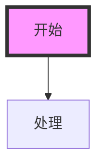

### 2. 子图
可以使用子图组织复杂流程：

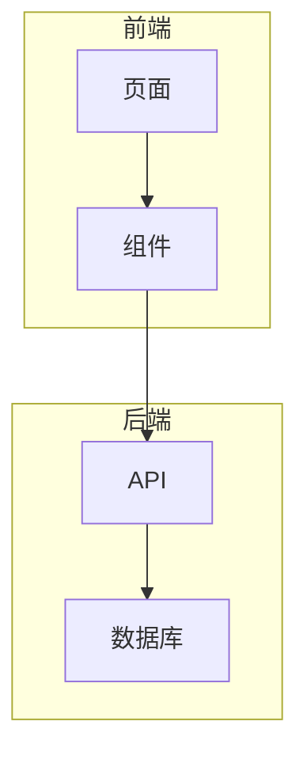

### 3. 注释
可以添加注释说明：

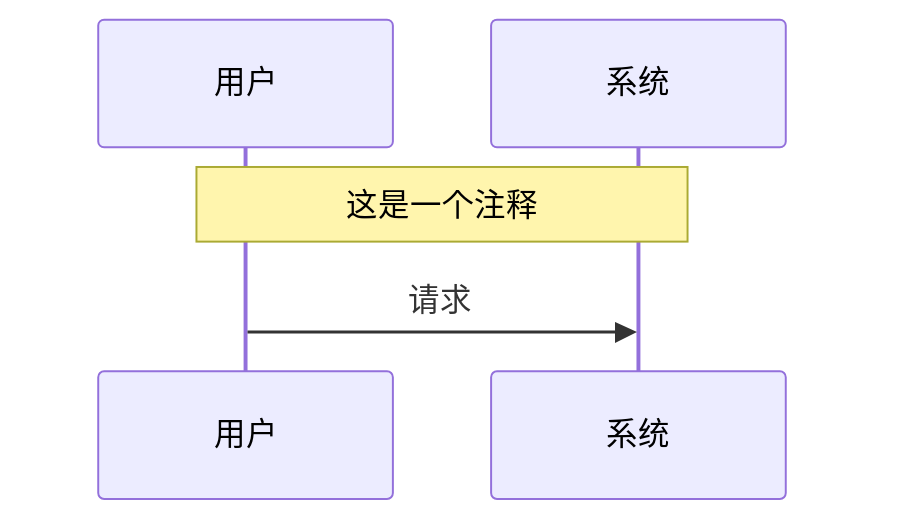
