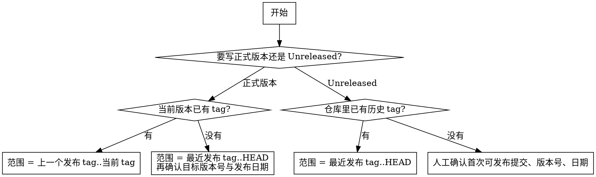

# 编写 CHANGELOG 技能

## 概览

`CHANGELOG.md` 是写给人的发布说明，不是 commit dump。

**核心原则：** 先确定发布边界，再从 Git 历史里提炼“用户可感知的显著变更”；任何直接输出 `git log` 或文件 diff 清单的做法都不合格。

## 何时使用

- 用户要求生成、更新或补写 `CHANGELOG.md`
- 用户要求根据 `git tag`、`git diff`、`git log` 生成 release notes
- 准备发布新版本，需要整理 `Unreleased` 或最近一个版本区间
- 仓库提交噪音较多，需要把多条 commit 汇总成 Keep a Changelog 条目
- 需要把 `feat/fix/refactor` 这类技术提交改写成用户可读的变更说明

不要用于：

- 只是查看某个 commit 的改动
- 只是生成 commit message
- 需要依赖平台 API、PR 评论、review 状态的场景

## 发布边界



## 核心流程

### 1. 先确定发布边界

- 正式版本：优先使用 `上一个发布 tag..当前发布 tag`
- 正式版本但当前 tag 还没打：使用 `最近发布 tag..HEAD`，同时确认目标版本号与发布日期
- `Unreleased`：使用 `最近发布 tag..HEAD`
- 没有任何 tag：停止自动推断，先确认：
  - 起点提交
  - 版本号
  - 发布日期
  - 是否存在“历史已发布但未打 tag”的版本

**不要**默认从第一个 commit 开始写首版 changelog。

### 2. 再抽取候选变更

- 优先使用 `git log --first-parent`
- merge commit 仓库：优先读主线 merge 标题与正文
- squash merge 仓库：优先读主线 commit 标题
- rebase merge 仓库：退回到 commit 粒度，但仍按主题归并

**目标：** 候选项尽量接近“一个 PR / 一个主题 = 一条 changelog 项”。

### 3. 用 diff 验证候选项

`commit message` 只能提供线索，不能直接当事实。

至少交叉验证以下信息：

- 改动是否真的影响用户可见行为
- 改动落在哪个模块或子系统
- 是新增、修复、行为变化，还是纯内部整理
- 是否存在删除、回滚、重命名、安全修复等特殊情况

优先使用：

- `git diff --name-status -M <range>`
- `git diff --stat <range>`
- `git show --stat <sha>`

必要时再看 patch 摘要。

### 4. 过滤噪音并归并主题

默认跳过以下内容，除非 diff 显示它确实改变了用户行为：

- `docs`
- `test`
- `ci`
- `style`
- 纯格式化
- 纯内部重构

处理规则：

- 同一主题下的碎 commit 合并成一条
- 同一发布区间内若存在完整 `revert`，前后都不写，只保留净效果
- 不要把 merge commit 标题、SHA、文件列表直接写进 changelog

### 5. 映射到 Keep a Changelog 分类

| 信号 | 分类 |
|---|---|
| `feat`、`add`、`support`、新增命令/接口/能力 | `Added` |
| 行为调整、默认值变化、性能变化、兼容性变化 | `Changed` |
| `deprecate`、标记过时、迁移提示 | `Deprecated` |
| `remove`、`drop`、停止支持、删除能力 | `Removed` |
| `fix`、`bugfix`、`hotfix`、回归修复 | `Fixed` |
| `security`、权限、鉴权、输入清洗、漏洞修复 | `Security` |

优先级从高到低：

1. `BREAKING CHANGE:`、`feat!:`、`fix!:` 等显式信号
2. commit 正文或 trailer
3. diff 体现出的实际行为
4. commit title 的启发式关键词

### 6. 生成最终输出

- 只保留非空章节
- 新版本放在前面
- 每个版本都要带日期
- 顶部可保留 `## [Unreleased]`
- 每条 bullet 都要写成“用户能理解的动作”
- 不要照抄技术性提交标题

## 数据源优先级

按以下顺序取数：

1. `git tag`
2. `git log --first-parent`
3. merge/squash commit 的标题与正文
4. `git diff --name-status -M` 与 `git diff --stat`
5. 必要时 `git show --stat <sha>`
6. commit body 中的 `BREAKING CHANGE:` 等显式信号

默认**不要依赖**：

- PR label
- 平台 API 返回的 PR 描述、评论、review 结论
- 作者名、提交时间以外的托管平台元数据

## 快速命令

```bash
# 查看发布 tag
git tag --sort=-creatordate

# 查看主线候选项
git log --first-parent --format='%H%x09%s' <range>

# 查看主线正文（适合 merge commit 仓库）
git log --first-parent --format='%H%n%s%n%b%n---' <range>

# 校验改动范围和类型
git diff --name-status -M <range>
git diff --stat <range>

# 查看单个候选项的概览
git show --stat <sha>
```

## 输出模板

```md
# Changelog

All notable changes to this project will be documented in this file.

## [Unreleased]

### Added
- 支持……

## [1.4.0] - 2026-03-09

### Changed
- 调整……

### Fixed
- 修复……
```

更多完整场景示例见 `references/examples.md`，优先参考：
- 已有 tag 的 `Unreleased`
- 当前 tag 未打但正在准备正式发版
- 无 tag 仓库的首版 changelog
- 含 `BREAKING CHANGE` 的版本说明

## 必问确认项

遇到以下情况必须先确认，不要擅自假设：

- 仓库没有任何 tag
- 当前是首个正式版本，还是补历史 changelog
- 版本号是 `Unreleased`、`0.x` 还是 `1.x`
- 发布日期用今天还是实际发布时间
- 是否纳入纯内部工程改动
- 是否存在必须单独强调的破坏性变更或安全修复

## 常见错误

- 直接把 `git log v1.2.0..HEAD` 粘进 changelog
- 只看 commit title，不看 diff
- 把 `docs`、`test`、`ci` 噪音写成版本亮点
- 把内部重构误写成用户功能
- 忽略 `revert`
- 没有 tag 时默认“从仓库第一个 commit 开始”

## 完成前检查

- [ ] 发布区间清晰且可复核
- [ ] 每条变更都能被 Git 历史或 diff 支撑
- [ ] 只保留 notable changes
- [ ] 分类符合 Keep a Changelog
- [ ] 没有原始 commit dump、SHA 列表或文件清单
- [ ] 需要人工确认的假设都已显式提出
